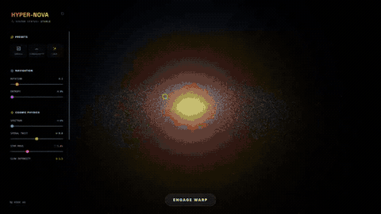
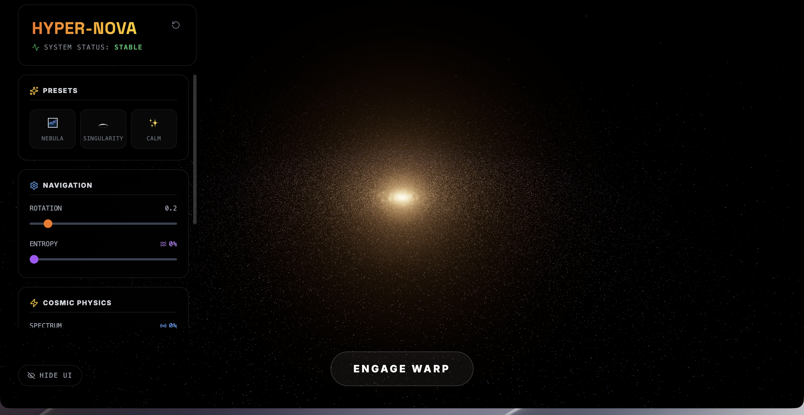
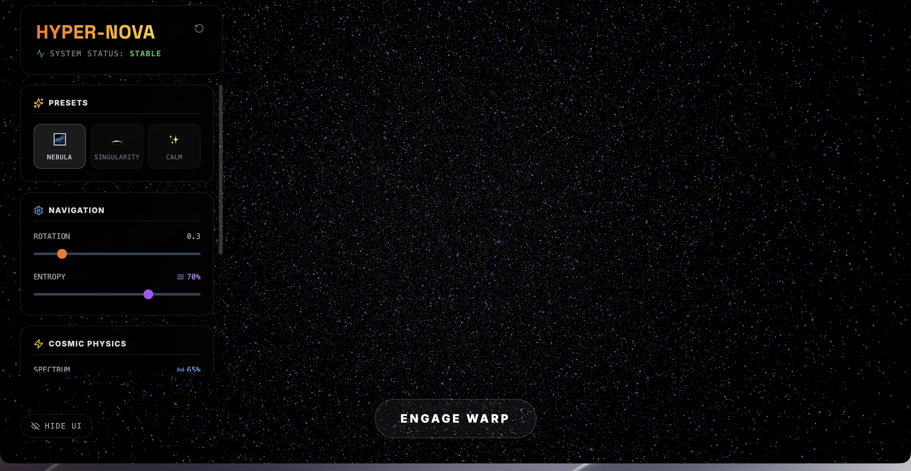
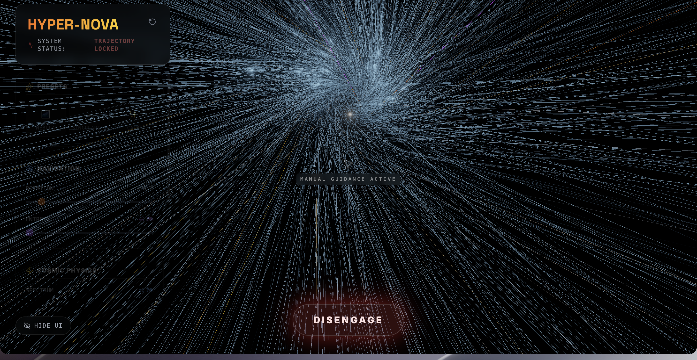
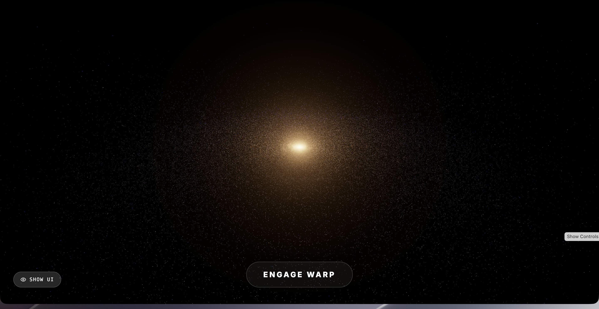

# Hyper-Nova Spectrum

An interactive WebGL galaxy simulator built with Three.js and custom GLSL shaders. 100,000 particles form a spiral galaxy that you can twist, dissolve, hue-shift, and warp through — all in real time.

## Quick Start

```bash
git clone https://github.com/AndrewVoirol/hyper-nova-spectrum.git
cd hyper-nova-spectrum
npm install
npm run dev
```

Opens at `http://localhost:3000`

## Screenshots









## How It Works

Drag to orbit, scroll to zoom. Use the slider panels on the left to shape the galaxy in real time — rotation speed, entropy (structure → chaos), spectrum shift (full hue rotation), spiral twist, star mass, bloom intensity, and singularity depth.

Hit **Engage Warp** for a warp-drive sequence: the galaxy redshifts past the camera, a light-streak tunnel forms around you, and you can steer with your mouse. Camera shake, FOV distortion, and chromatic aberration sell the effect.

Three **presets** (Nebula, Singularity, Calm) give you instant starting points. **Hide UI** clears the panels so you can just watch.

Under the hood, the scene runs entirely on custom GLSL vertex/fragment shaders — one for the galaxy particles (with per-vertex hue shifting and warp morphing), one for the tunnel line segments (with spiral twist, chromatic aberration, and mouse-reactive bending), and one for the destination singularity (pulsing core with ring ripples). Post-processing uses Three.js UnrealBloomPass for the glow.

## Tech Stack

| Layer | Tech |
|-------|------|
| Framework | React 19 |
| 3D Engine | Three.js r181 |
| Shaders | Custom GLSL (vertex + fragment) |
| Post-processing | UnrealBloomPass, EffectComposer |
| Styling | Tailwind CSS 3 |
| Icons | Lucide React |
| Build | Vite 6 |

## License

MIT
